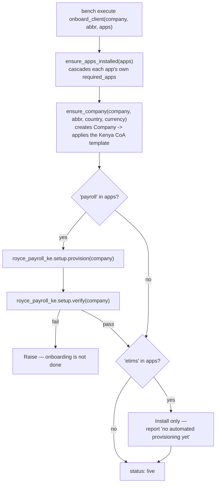
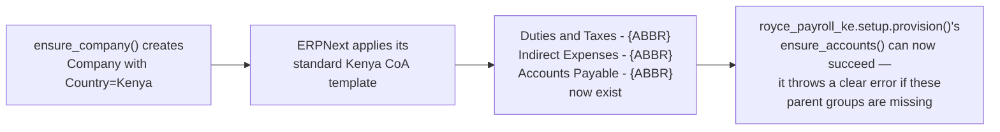

# Royce Provision — Architecture Reference

Status: **built, verified against a real onboarding run**. Update this file as decisions change —
it's meant to stay current, not to be a one-time snapshot.

This app is Royce Cloud's own control-plane tool. It is never installed on a client's site — only
on Royce's own infrastructure, wherever staff actually run onboarding from. See
`royce_payroll_ke/docs/architecture.md` for the Compliance Cloud tenancy decisions this assumes
(Model A — one site per client, shared bench) and `royce_etims/docs/architecture.md` for that app's
own state.

## Decisions locked so far

- **A thin bundler, not an owner.** This app knows nothing about payroll math or eTIMS device
  registration. It only knows how to call each compliance app's own provisioning routine, in order,
  plus the one piece of setup that belongs to neither of them individually — the Company record
  itself has to exist with the right Country before `royce_payroll_ke`'s Chart of Accounts step can
  succeed. Each compliance app stays able to provision itself standalone, for Provision 2
  (self-hosted) clients who never touch this app at all.
- **A bench command, not a UI, for v1.** Matches the decision already recorded in
  `royce_payroll_ke`'s own architecture doc: onboarding is Royce staff, by hand, via
  `bench execute`, not an admin screen. The pipeline is plain functions from day one specifically so
  a UI (or eventually self-serve) is a new caller added later, not a rewrite.
- **Site creation stays a separate, manual step.** `bench new-site` is not something this app
  wraps. `onboard_client()` picks up from an existing site — creating the Company, installing the
  apps this client bought, and provisioning them — not from nothing.
- **`royce_etims` has no `provision()` yet, and is not faked into having one.** Checked before
  building, not assumed: no `provision()`-style entry point exists in `royce_etims` as of this
  writing, and its own architecture doc is explicit that KRA registration needs a human entering a
  real TIN and Apigee credentials — it can never be a no-input call the way payroll is.
  `PRODUCTS["etims"]` in `onboarding.py` installs the app and reports honestly that provisioning
  isn't automated yet, rather than silently doing nothing while claiming success.

## Open / not yet decided

- Whether `royce_etims` ever gets a `provision()` worth calling here, or whether its onboarding
  stays a human checklist permanently given the KRA-credentials requirement.
- Whether this app eventually needs to shell out to `bench new-site` itself (making onboarding
  genuinely one command end to end) or whether site creation staying manual is fine indefinitely.
- Self-serve — deliberately not designed for yet. The functions here are the foundation for it
  whenever it's warranted, not a decision that it's coming.

---

## 1. What "onboard a client" actually does

Verified against a real run, not a description of intended behavior: a company that had never
existed before (`Acme Test Ltd`) went from zero to a fully `verify()`-passing Kenya payroll setup —
Chart of Accounts, 22 components, Salary Structure — in one call, with `royce_etims` correctly
installed on demand and honestly reporting it has nothing further to do yet.

## 2. Why `ensure_company` is not decorative

This is the one piece of company-level setup that belongs to `royce_provision` rather than to
`royce_payroll_ke` itself: `royce_payroll_ke` correctly assumes a properly-created Company already
exists (that assumption is what keeps it usable standalone, without needing to know how a client
onboarding flow works) — something has to make that assumption true for a brand new client, and
that something is this app, not a manual step someone has to remember.

## 3. A real bug this caught, not a hypothetical

First live run failed immediately: `AttributeError: module 'frappe' has no attribute 'installer'`.
`frappe.installer` is a real submodule, but Python doesn't auto-expose submodules as attributes of
a package just because the package itself is imported — it needs its own explicit
`from frappe.installer import install_app`, not an attribute-path reference assumed to work because
it reads naturally. Fixed, then re-run confirmed clean.
