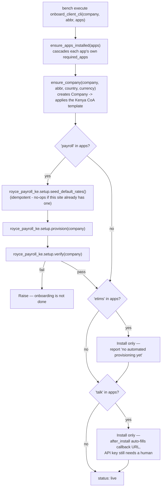
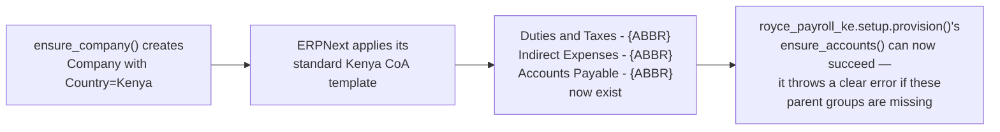

# Royce Provision — Architecture Reference

Status: **built, verified against a real onboarding run**. Update this file as decisions change —
it's meant to stay current, not to be a one-time snapshot.

This app IS installed on each client's site — corrected here after this contradicted the user
guide's own Prerequisites table, and after `frappe.get_attr()` was confirmed empirically to refuse
to resolve into any app that isn't in the site's `installed_apps`, regardless of whether it's
present in the shared bench. `bench execute module.path.fn` fails with `AppNotInstalledError`
(itself then masked by bench's own fallback into a confusing `NameError` — see the user guide's
troubleshooting table) against a site that never ran `bench install-app royce_provision`.
`onboard-client.sh`'s `bench new-site` call already installs it for every new site; it only needs
installing by hand on sites that predate this app. What *is* still true: this app is Royce Cloud's
own control-plane tool, never surfaced to a client as a product they interact with — "installed on
the site" and "something the client sees or uses" are different claims, and only the first one is
correct. See `royce_payroll_ke/docs/architecture.md` for the Compliance Cloud tenancy decisions this
assumes (Model A — one site per client, shared bench) and `royce_etims/docs/architecture.md` for
that app's own state.

## Decisions locked so far

- **A thin bundler, not an owner.** This app knows nothing about payroll math or eTIMS device
  registration. It only knows how to call each compliance app's own provisioning routine, in order,
  plus the one piece of setup that belongs to neither of them individually — the Company record
  itself has to exist with the right Country before `royce_payroll_ke`'s Chart of Accounts step can
  succeed. Each compliance app stays able to provision itself standalone, for Provision 2
  (self-hosted) clients who never touch this app at all.
- **A bench command, not a UI, for v1.** Matches the decision already recorded in
  `royce_payroll_ke`'s own architecture doc: onboarding is Royce staff, by hand, via
  `bench execute`, not an admin screen. The pipeline is plain functions from day one specifically so
  a UI (or eventually self-serve) is a new caller added later, not a rewrite.
- **Site creation stays a separate, manual step.** `bench new-site` is not something this app
  wraps. `onboard_client()` picks up from an existing site — creating the Company, installing the
  apps this client bought, and provisioning them — not from nothing.
- **`royce_etims` and `royce_talk` have no `provision()` yet, and neither is faked into having one.**
  Checked before building, not assumed: no `provision()`-style entry point exists in either app as
  of this writing. Neither can ever be a no-input call the way payroll is — `royce_etims`'s own
  architecture doc is explicit that KRA registration needs a human entering a real TIN and Apigee
  credentials, and `royce_talk` needs a human entering a real RoyceTalk API key and Sender ID.
  `PRODUCTS["etims"]` and `PRODUCTS["talk"]` in `onboarding.py` install their app and report
  honestly that provisioning isn't automated, rather than silently doing nothing while claiming
  success.
- **`payroll` has a real prerequisite, and it's per-SITE, not per-company or per-bench —
  corrected here after getting this wrong the first time.** `PayrollRates.get_effective()` has no
  company filter, which reads as "one shared record for everything" — but Model A means one site
  (one database) per client, and Payroll Rates doesn't cross that boundary any more than any other
  doctype does. A fresh client's site genuinely has no rates record yet, regardless of what other
  clients' sites have. Given that, keeping it a separate manual step per site would just be a
  prerequisite someone forgets, not a meaningful safety boundary — so `onboard_client()`'s payroll
  branch calls `seed_default_rates()` itself, every time, before `provision()`. Safe because it's
  idempotent (no-ops if this site already has an effective record); the function itself still
  exists standalone for anyone who wants different values than the shipped default.

## Open / not yet decided

- Whether `royce_etims` or `royce_talk` ever get a `provision()` worth calling here, or whether
  their onboarding stays a human checklist permanently given the credentials each needs.
- Whether this app eventually needs to shell out to `bench new-site` itself (making onboarding
  genuinely one command end to end) or whether site creation staying manual is fine indefinitely.
- Self-serve — deliberately not designed for yet. The functions here are the foundation for it
  whenever it's warranted, not a decision that it's coming.

---

## 1. What "onboard a client" actually does

Verified against a real run, not a description of intended behavior: a company that had never
existed before (`Acme Test Ltd`) went from zero to a fully `verify()`-passing Kenya payroll setup —
Chart of Accounts, 22 components, Salary Structure — in one call, with `royce_etims` correctly
installed on demand and honestly reporting it has nothing further to do yet.

## 2. Why `ensure_company` is not decorative

This is the one piece of company-level setup that belongs to `royce_provision` rather than to
`royce_payroll_ke` itself: `royce_payroll_ke` correctly assumes a properly-created Company already
exists (that assumption is what keeps it usable standalone, without needing to know how a client
onboarding flow works) — something has to make that assumption true for a brand new client, and
that something is this app, not a manual step someone has to remember.

## 3. A real bug this caught, not a hypothetical

First live run failed immediately: `AttributeError: module 'frappe' has no attribute 'installer'`.
`frappe.installer` is a real submodule, but Python doesn't auto-expose submodules as attributes of
a package just because the package itself is imported — it needs its own explicit
`from frappe.installer import install_app`, not an attribute-path reference assumed to work because
it reads naturally. Fixed, then re-run confirmed clean.

## 4. `bench execute` masks real errors — worked around, not fixed upstream

Found while wiring `onboard-client.sh` up to a real image build, not a hypothetical either.
`bench execute module.path.fn` first tries `frappe.get_attr(method)(*args, **kwargs)`; if *that*
raises anything — an app not installed, a validation error from deep inside `onboard_client()`,
anything — bench's own `execute()` doesn't surface it. It falls through to a fallback that compiles
the method path itself as a bare expression and evals it, which fails with an unrelated
`NameError: name 'royce_provision' is not defined` no matter what the real problem was. Confirmed
directly against this bench version's source (`frappe/commands/utils.py`), not inferred.

This directly undermined the "don't paper over a provisioning failure, surface the real error"
principle this app and `onboard-client.sh` both rely on — staff would see a useless `NameError`
instead of e.g. "No effective, submitted Payroll Rates record found." `bench console` isn't a
usable substitute either: a `sys.exit(1)` raised inside a piped console session gets caught by
IPython as "user wants to quit," prompts for confirmation, and the outer process exits `0`
regardless of what happened inside.

Fix: `onboard_client_cli()` — a wrapper that never raises. It calls `onboard_client()`, catches
everything, and returns a plain dict either way (`{"status": "error", "error_type": ..., "message":
...}` on failure). Since it never raises, `bench execute` always takes its normal success path and
the real error ends up in the printed result. `onboard-client.sh` calls this wrapper, not
`onboard_client()` directly, and checks the returned `status` field itself rather than relying on
bench's exit code. `onboard_client()` keeps its original raise-on-failure behavior for direct/
interactive callers (bench console, a future UI) where exceptions surface fine on their own.

## 5. "Once per bench" was wrong — Payroll Rates is per-site

Shipped and documented `seed_default_rates()` as a once-per-bench bootstrap, on the reasoning that
`PayrollRates.get_effective()` has no company filter so it must be "one shared record." That's true
within a single site's database — it says nothing about *across* sites, and Model A puts one
site (one database) per client. A fresh client's site has no rates record no matter how many other
clients already onboarded, so "once per bench" would have meant every second-or-later client
hitting `"No effective, submitted Payroll Rates record found"` on their first payroll onboarding —
a confusing failure for something that should just work.

Caught before it shipped to a real client, not after — corrected by making `onboard_client()`'s
payroll branch call `seed_default_rates()` itself (section "Decisions locked so far" above), so the
per-site reality is handled automatically instead of depending on someone reading this doc's
original, wrong claim closely enough to catch the gap.
